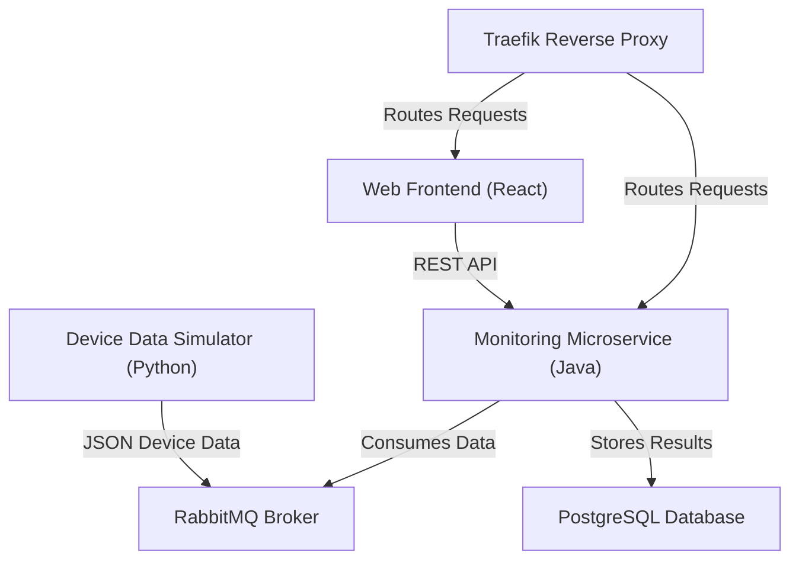

# UML Deployment Diagram

- All services are containerized and orchestrated via Docker Compose.
- Traefik reverse proxy exposes frontend and API endpoints.
- RabbitMQ handles both device data and synchronization events.
